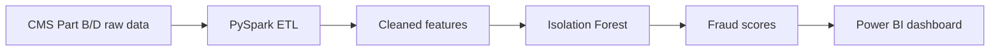

# MedClaim Guard — Healthcare Claims Fraud Detection & Analytics

A fraud-detection and analytics project on U.S. Medicare claims data. It builds
an ETL pipeline over CMS Medicare Part B and Part D data, flags anomalous
provider behavior with an unsupervised model, and visualizes the results in an
interactive Power BI dashboard.

## Highlights

- Processes 10M+ rows of CMS Medicare Part B & Part D claims
- PySpark ETL for cleaning and feature preparation
- Anomaly/fraud scoring using an Isolation Forest model
- Interactive Power BI dashboard for exploring flagged providers

## Tech Stack

Python · PySpark · scikit-learn (Isolation Forest) · Power BI · pandas

## Project Structure

```
.
├── Scripts/
│   ├── prepare_partb.py       # Clean & prepare Part B data
│   └── score_partb_fraud.py   # Score providers for anomalies
├── Notebooks/
│   └── 01_data_preparation.ipynb
└── requirements.txt
```

## Architecture



**Skills demonstrated:** large-scale data engineering with PySpark, unsupervised anomaly detection (Isolation Forest), and turning model output into a stakeholder-facing dashboard.

## Data

The raw datasets are **not included** in this repository (they are large and
publicly available). Download them from the CMS website:

- Medicare Part B: CMS Medicare Provider Utilization & Payment Data (Part B)
- Medicare Part D: CMS Medicare Part D Prescriber data

Place the files under `data/raw/` (git-ignored). The scripts write cleaned and
scored outputs to `data/processed/`.

## Setup

```bash
python -m venv .venv && source .venv/bin/activate   # Windows: .venv\Scripts\activate
pip install -r requirements.txt
```

## Usage

```bash
python Scripts/prepare_partb.py        # clean & prepare
python Scripts/score_partb_fraud.py    # anomaly scoring
```

Open the Power BI dashboard (`.pbix`, not tracked here due to size) to explore
the scored results.

## License

Released under the [MIT License](LICENSE).
